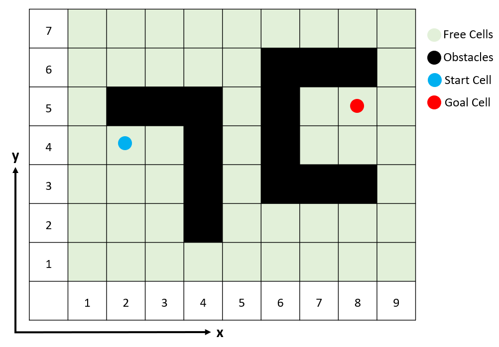

# RRTs Alorithm
This Repository contains different RRT methods in C++ (object oriented programming)

## Compiling requirements
- requires compiler support for C++11

## How to run with an example
Let's consider we have a map as below:



After running the code, you will see an output like below, here you need to enter the number of rows inside the map. For this example, we need to enter 7.

```sh
Please type the number of rows: 7
```
Then it asks about the number of column (9 in this example).
```sh
Please type the number of columns: 9
```
Then you need to enter the number of obstacle cells (14 in this case), and the locations of them:
```sh
Please determine the number of cells acts as obstacles: 14
Please enter the location of each obstacle:
x1: 2
y1: 5
x2: 3
y2: 5
x3: 4
y3: 5
x4: 4
y4: 4
x5: 4
y5: 3
x6: 4
y6: 2
x7: 8
y7: 6
x8: 7
y8: 6
x9: 6
y9: 6
x10: 6
y10: 5
x11: 6
y11: 4
x12: 6
y12: 3
x13: 7
y13: 3
x14: 8
y14: 3
```
Next step is defining the start point, first x and second y.
```sh
Please determine the location of the start Cell with integers {Sx, Sy, Syaw(1. North, 2. South, 3. East, 4. West)}: 
2
4
```
Finally, repeat the previous step for the goal cell.
```sh
Please determine the location of the goal Cell with integers {Gx, Gy, Gyaw(1. North, 2. South, 3. East, 4. West)}: 
8
5
```
The code will take care of the rest and here how the output looks like for RRT and RRT-Connect:
```sh
The start point would be: (1.5, 3.5)
The goal point would be: (7.5, 4.5)

Map of the scenario: (S is the Startpoint, G is the Goalpoint and X is the obstacle)
X X X X X X X X X X X
X . . . . . . . . . X
X . . . . . X X X . X
X . X X X . X . G . X
X . S . X . X . . . X
X . . . X . X X X . X
X . . . X . . . . . X
X . . . . . . . . . X
X X X X X X X X X X X

Path found:
(1.5, 3.5) (0.782689, 3.72826) (0.375761, 1.7701) (0.977701, 0.859154) (2.02687, 0.622464) (4.02569, 0.553759) (6.0139, 0.33696) 
(6.56389, 0.772571) (6.14803, 1.33598) (6.74307, 1.63265) (7.26271, 1.74305) (7.46171, 1.87462) (7.37606, 1.84168)
(7.23789, 1.95957) (6.73802, 3.12998) (7.30415, 3.60893) (7.14435, 4.10782) (7.51123, 4.49844)
```
The method consider the center of a cell as start and end point. That is why the robot starts from (1.5, 3.5) instead of (2, 4). Then results shows the scenario, and finally shows the path.

The RRT-Rope response would be a little bit different. In addition to the result of the RRT-Rope it also print the RRT-Connect result.

To learn more you can watch the videos below:
